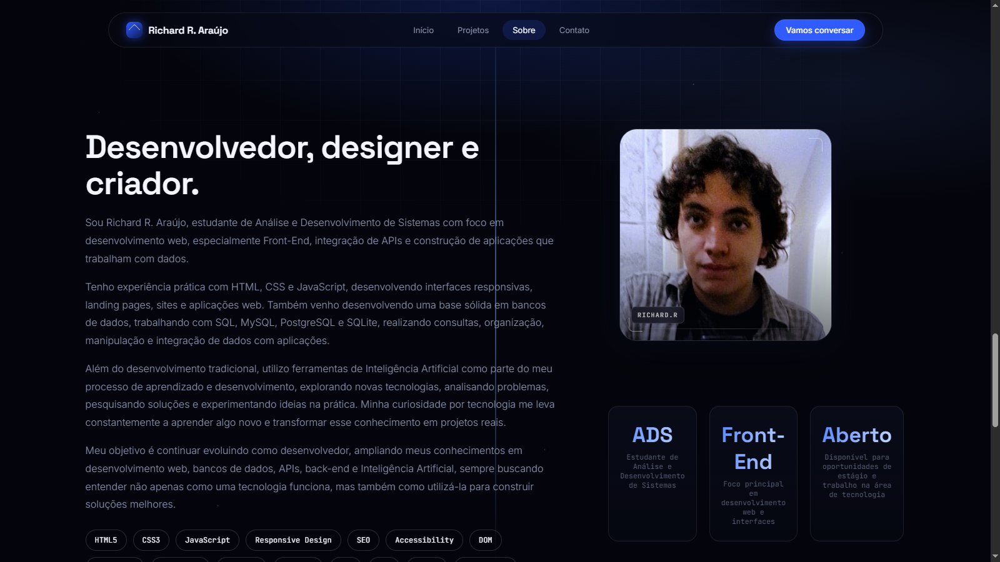
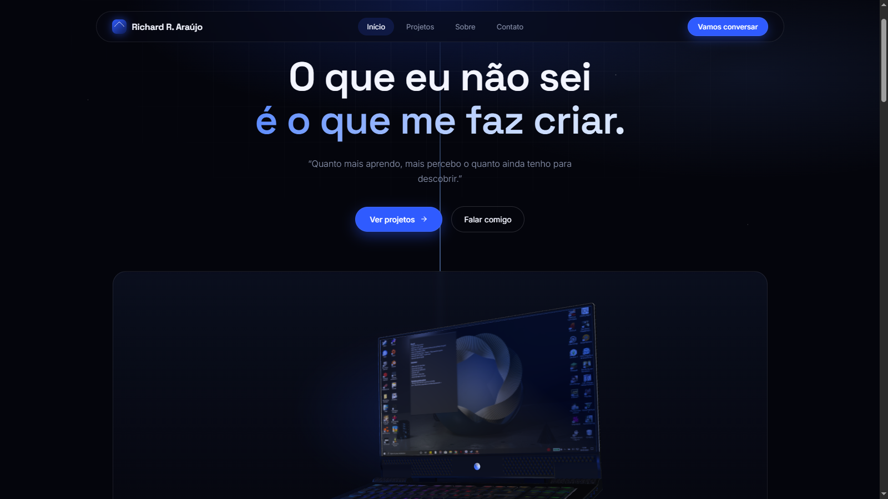
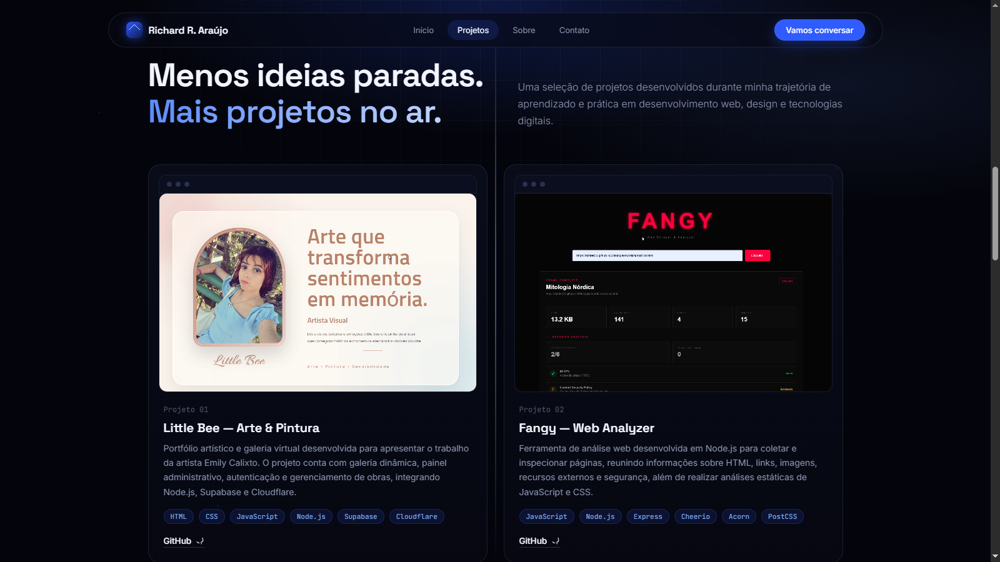
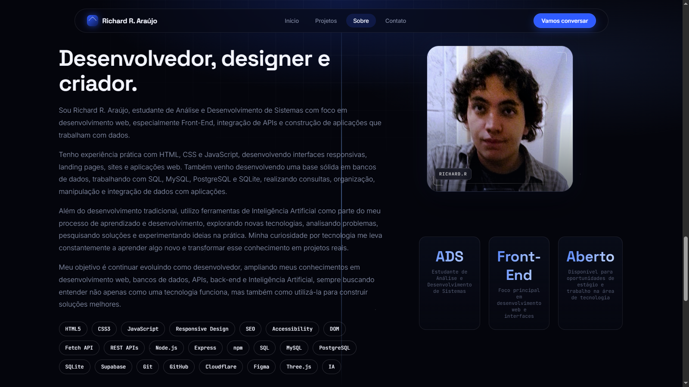
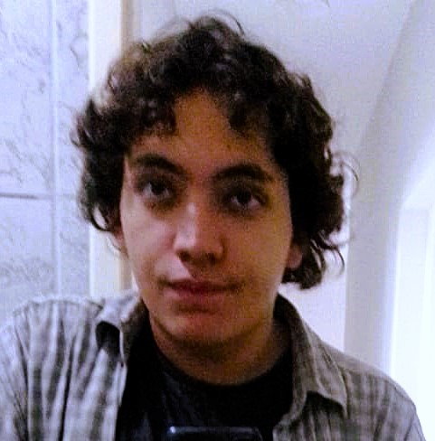
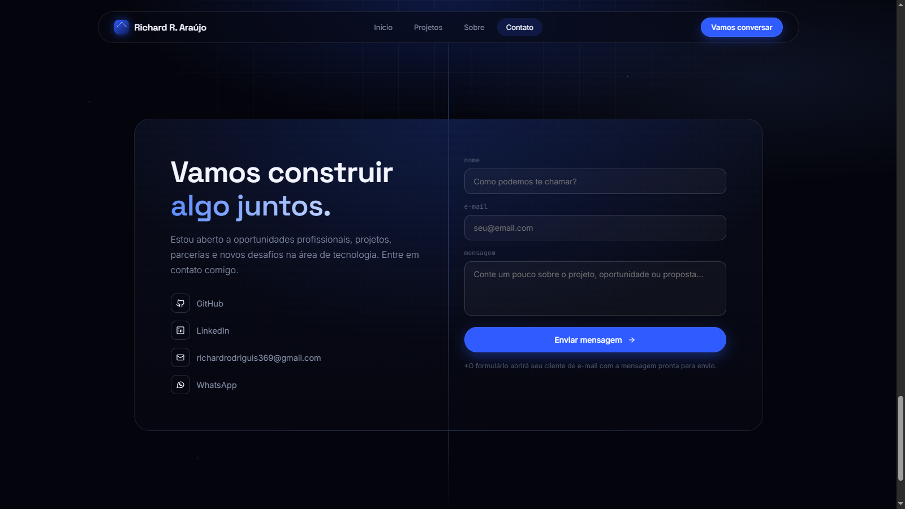

# Richard R. Araújo — Portfólio Web

<p align="center">
  
</p>

<p align="center">
  <strong>Portfólio pessoal • Front-End • Web Development • Design • Projetos reais</strong>
</p>

<p align="center">
  <a href="https://github.com/Richter06">GitHub</a> •
  <a href="https://www.linkedin.com/in/richard-r-ara%C3%BAjo/">LinkedIn</a> •
  <a href="mailto:richardrodriguis369@gmail.com">E-mail</a> •
  <a href="https://wa.me/5585973822711">WhatsApp</a>
</p>

---

## Sobre o projeto

Este repositório contém o portfólio pessoal de **Richard R. Araújo**, estudante de Análise e Desenvolvimento de Sistemas e desenvolvedor com foco principal em **Front-End e desenvolvimento web**.

Mais do que uma página de apresentação, o projeto foi construído como uma demonstração prática de conhecimentos em **HTML, CSS, JavaScript, desenvolvimento de interfaces, responsividade, integração com APIs, manipulação do DOM, animações, acessibilidade, SEO e visualização 3D no navegador**.

A proposta visual segue uma identidade tecnológica, minimalista e cinematográfica, utilizando fundo escuro, elementos em azul, tipografia moderna, microinterações e uma experiência de navegação orientada por seções.

---

## Visão geral

<p align="center">
  
</p>

O portfólio apresenta uma experiência de navegação composta por:

- Hero section com apresentação e chamadas para ação;
- Modelo 3D interativo de um notebook;
- Marquee animado com tecnologias e ferramentas;
- Galeria de projetos com demonstrações em vídeo;
- Seção Sobre com apresentação profissional, foto e competências;
- Indicadores resumindo formação, foco profissional e disponibilidade;
- Área de contato com GitHub, LinkedIn, e-mail e WhatsApp;
- Formulário que prepara uma mensagem através de `mailto:`;
- Footer com navegação interna e retorno ao topo.

---

## ✨ Destaques

### 🖥️ Experiência visual

A interface utiliza uma linguagem visual baseada em:

- Dark UI;
- Gradientes e brilhos sutis em azul;
- Cards translúcidos;
- Bordas e sombras suaves;
- Grid visual de fundo;
- Tipografia `Space Grotesk`, `Inter` e `JetBrains Mono`;
- Microinterações e transições;
- Animações de entrada durante a rolagem;
- Layout adaptado para diferentes tamanhos de tela.

### 🧊 Modelo 3D interativo

O Hero possui uma cena 3D renderizada diretamente no navegador através do **Three.js**.

O projeto utiliza:

- `WebGLRenderer`;
- `PerspectiveCamera`;
- `GLTFLoader`;
- modelo `.glb` local;
- iluminação e composição da cena;
- controle de rotação do modelo;
- redimensionamento responsivo do canvas;
- fallback visual quando o modelo não pode ser carregado.

O arquivo utilizado é:

```text
gaming_laptop.glb
```

---

## 🧩 Arquitetura

O projeto foi propositalmente mantido como uma aplicação web **front-end independente**, sem necessidade de framework ou processo de build.

```text
portifolioDev/
│
├── assets/
│   ├── contatos.png
│   ├── eu.png
│   ├── header.png
│   ├── icons8-code-96.png
│   ├── ogImage.png
│   ├── projetos.png
│   └── sobre.png
│
├── demos/
│   ├── Clínica Vita+ _ Login - Google Chrome 2026-08-25 16-53-28.mp4
│   ├── Fangy — Web Analyzer - Google Chrome 2026-08-25 16-48-33.mp4
│   ├── Little Bee _ Arte & Pintura - Google Chrome 2026-08-25 16-41-51.mp4
│   └── Mayk VS Aliens - Google Chrome 2026-08-25 16-58-59.mp4
│
├── gaming_laptop.glb
├── index.html
└── README.md
```

### `index.html`

É o núcleo da aplicação. O arquivo reúne:

- estrutura semântica da página;
- metadados SEO;
- Open Graph;
- Twitter/X Card;
- estilos CSS;
- componentes visuais;
- estrutura dos projetos;
- formulário de contato;
- scripts de interação;
- inicialização da cena 3D.

A aplicação não depende de um bundler para funcionar.

### `assets/`

Concentra imagens utilizadas pelo próprio portfólio e também imagens preparadas para documentação e compartilhamento.

| Arquivo | Utilização |
|---|---|
| `header.png` | Registro visual da seção inicial |
| `eu.png` | Foto utilizada na seção Sobre |
| `sobre.png` | Captura da seção Sobre |
| `projetos.png` | Captura da seção de projetos |
| `contatos.png` | Captura da seção de contato |
| `ogImage.png` | Imagem de compartilhamento / Open Graph |
| `icons8-code-96.png` | Favicon / ícone do site |

### `demos/`

Contém gravações em vídeo utilizadas diretamente nos cards de projetos. Os vídeos são carregados com `<video>` e configurados para reprodução silenciosa e em loop durante a interação com os cards.

### `gaming_laptop.glb`

Modelo 3D utilizado na apresentação do portfólio.

---

## 🧭 Estrutura da interface

### 1. Hero

<p align="center">
  
</p>

A primeira seção apresenta a identidade do portfólio e direciona o visitante para duas ações principais:

- visualizar projetos;
- entrar em contato.

O destaque visual fica por conta da combinação entre tipografia, gradientes, animações e o notebook 3D.

---

### 2. Stack tecnológica

O projeto possui uma faixa horizontal animada que apresenta tecnologias e ferramentas utilizadas na trajetória de desenvolvimento.

Entre os itens exibidos estão:

- HTML;
- CSS;
- JavaScript;
- Python;
- SQL;
- MySQL;
- PostgreSQL;
- SQLite;
- Supabase;
- Node.js;
- Express;
- REST APIs;
- Git;
- GitHub;
- VS Code;
- Figma;
- Cloudflare;
- Vercel;
- Render;
- WAMP;
- XAMPP.

O conteúdo do marquee é gerado dinamicamente pelo JavaScript e duplicado para produzir o efeito de rolagem contínua.

---

### 3. Projetos

<p align="center">
  
</p>

A seção funciona como uma vitrine dos principais projetos desenvolvidos durante a trajetória de aprendizado e prática.

Cada card possui:

- demonstração em vídeo;
- identificação do projeto;
- descrição técnica;
- tecnologias utilizadas;
- link para o respectivo repositório.

#### Projeto 01 — Little Bee — Arte & Pintura

Portfólio artístico e galeria virtual desenvolvido para apresentar o trabalho da artista Emily Calixto.

O projeto envolve:

- galeria dinâmica;
- painel administrativo;
- autenticação;
- gerenciamento de obras;
- integração com Node.js;
- Supabase;
- Cloudflare.

**Repositório:** https://github.com/Richter06/paginaDeArtesVisuais

#### Projeto 02 — Fangy — Web Analyzer

Ferramenta de análise web desenvolvida em Node.js para coletar e inspecionar páginas.

O projeto trabalha com análise de:

- HTML;
- links;
- imagens;
- recursos externos;
- segurança;
- JavaScript;
- CSS.

Tecnologias destacadas:

- Node.js;
- Express;
- Cheerio;
- Acorn;
- PostCSS.

**Repositório:** https://github.com/Richter06/FangyScraper

#### Projeto 03 — Clínica Vita+

Interface web desenvolvida para uma clínica, priorizando uma experiência de acesso simples, organizada e responsiva.

O projeto demonstra:

- construção de interface;
- responsividade;
- UI/UX;
- organização visual;
- interação com JavaScript.

**Repositório:** https://github.com/Richter06/clinica

#### Projeto 04 — Mayk VS Aliens

Projeto desenvolvido como prática de JavaScript e programação interativa no navegador.

Entre os conceitos trabalhados estão:

- lógica de jogo;
- movimentação;
- interação entre elementos;
- manipulação dinâmica;
- Canvas;
- Game Development.

**Repositório:** https://github.com/Richter06/mayk-vs-aliens

---

## 👤 Sobre o desenvolvedor

<p align="center">
  
</p>

A seção Sobre apresenta Richard R. Araújo como estudante de **Análise e Desenvolvimento de Sistemas**, com foco em desenvolvimento web, especialmente Front-End, integração de APIs e aplicações orientadas a dados.

A apresentação também destaca conhecimentos práticos em:

- HTML5;
- CSS3;
- JavaScript;
- Responsive Design;
- SEO;
- Accessibility;
- DOM;
- Fetch API;
- REST APIs;
- Node.js;
- Express;
- npm;
- SQL;
- MySQL;
- PostgreSQL;
- SQLite;
- Supabase;
- Git;
- GitHub;
- Cloudflare;
- Figma;
- Three.js;
- Inteligência Artificial.

<p align="center">
  
</p>

### Indicadores profissionais

A área de destaque resume três informações importantes:

| Indicador | Significado |
|---|---|
| **ADS** | Estudante de Análise e Desenvolvimento de Sistemas |
| **Front-End** | Foco principal em desenvolvimento web e interfaces |
| **Aberto** | Disponível para oportunidades de estágio e trabalho na área de tecnologia |

---

## 📬 Contato

<p align="center">
  
</p>

A seção de contato foi pensada para transformar o portfólio em um ponto de entrada profissional.

Canais disponíveis:

- **GitHub:** https://github.com/Richter06
- **LinkedIn:** https://www.linkedin.com/in/richard-r-ara%C3%BAjo/
- **E-mail:** richardrodriguis369@gmail.com
- **WhatsApp:** https://wa.me/5585973822711

### Formulário

O formulário coleta:

- nome;
- e-mail;
- mensagem.

Ao enviar, o JavaScript monta dinamicamente o assunto e o corpo da mensagem e utiliza `mailto:` para abrir o cliente de e-mail do visitante com os dados preenchidos.

Isso mantém o projeto simples e sem necessidade de um servidor de envio de e-mails.

---

## ⚙️ Tecnologias utilizadas

### Front-End

| Tecnologia | Aplicação |
|---|---|
| **HTML5** | Estrutura e semântica |
| **CSS3** | Layout, responsividade, animações e identidade visual |
| **JavaScript** | Interações, DOM, observers, formulário e lógica da interface |
| **Three.js** | Renderização do modelo 3D |
| **WebGL** | Renderização gráfica da cena 3D |

### Ferramentas e serviços

| Tecnologia | Uso no ecossistema |
|---|---|
| **Git** | Versionamento |
| **GitHub** | Hospedagem do código e documentação |
| **VS Code** | Ambiente de desenvolvimento |
| **Figma** | Design e prototipação |
| **Cloudflare** | Tecnologia presente no ecossistema de projetos apresentados |
| **Vercel** | Tecnologia presente no ecossistema de projetos apresentados |
| **Render** | Tecnologia presente no ecossistema de projetos apresentados |

---

## 🧠 Recursos técnicos implementados

### Intersection Observer

O portfólio utiliza `IntersectionObserver` para controlar elementos que entram na viewport, permitindo animações de reveal sem depender de listeners de scroll executados continuamente.

Os elementos utilizam atributos como:

```html
<div data-reveal>
```

ou:

```html
<div data-reveal="left">
```

```html
<div data-reveal="right">
```

```html
<div data-reveal="scale">
```

---

### Preferência por redução de movimento

A aplicação considera a preferência do usuário através de:

```js
window.matchMedia('(prefers-reduced-motion: reduce)')
```

Quando a preferência está ativa, as animações são reduzidas e os elementos de reveal são exibidos diretamente.

Isso melhora a acessibilidade e evita excesso de movimento para usuários que optaram por reduzir animações no sistema operacional ou navegador.

---

### Navegação responsiva

Em telas menores, o menu principal é transformado em uma navegação compacta acionada pelo botão mobile.

O JavaScript controla:

- abertura do menu;
- fechamento ao selecionar um link;
- estado visual do menu;
- navegação entre seções.

Além disso, um `IntersectionObserver` identifica a seção atualmente visível e atualiza o link ativo da navegação.

---

### Reprodução inteligente dos vídeos

Os vídeos dos projetos não ficam necessariamente reproduzindo o tempo inteiro.

O JavaScript adiciona eventos aos cards para:

1. iniciar o vídeo quando o mouse entra no card;
2. pausar quando o mouse sai;
3. retornar o vídeo para o início.

Isso cria uma prévia interativa sem transformar a seção em uma sequência de vídeos reproduzindo simultaneamente.

---

### Marquee dinâmico

A lista de tecnologias é definida em JavaScript e transformada em elementos HTML automaticamente.

A lista é duplicada para criar uma faixa contínua:

```js
var doubled = stack.concat(stack);
```

Os itens são então renderizados dentro de `#marquee-track`.

---

### SEO e compartilhamento

O `<head>` contém metadados destinados a mecanismos de busca e plataformas de compartilhamento, incluindo:

- `description`;
- `author`;
- `keywords`;
- `robots`;
- Open Graph;
- Twitter/X Card;
- favicon;
- idioma `pt-BR`;
- viewport responsivo.

A imagem preparada para compartilhamento está localizada em:

```text
assets/ogImage.png
```

---

## 📱 Responsividade

O layout possui regras específicas para diferentes larguras de tela, com atenção especial à experiência mobile.

Entre os ajustes realizados estão:

- redução de espaçamentos;
- tipografia fluida;
- botões ocupando a largura disponível;
- projetos em uma coluna;
- adaptação do modelo 3D;
- navegação mobile;
- ajuste de cards;
- reorganização da seção Sobre;
- adaptação do formulário de contato;
- redução de elementos visuais em telas pequenas.

---

## 🚀 Como executar

O projeto não exige instalação de dependências para sua versão atual.

### 1. Clone o repositório

```bash
git clone https://github.com/Richter06/portifolioDev.git
```

### 2. Entre na pasta

```bash
cd portifolioDev
```

### 3. Execute através de um servidor local

Como o projeto utiliza módulos JavaScript e carrega um modelo `.glb`, o ideal é utilizar um servidor HTTP local em vez de abrir o `index.html` diretamente com `file://`.

Por exemplo, com uma extensão de servidor local no VS Code, abra o projeto e execute o `index.html` através do servidor.

Também é possível utilizar qualquer servidor HTTP estático de sua preferência.

### 4. Acesse no navegador

Abra o endereço fornecido pelo servidor local.

---

## 📁 Fluxo de funcionamento

```text
                         ┌──────────────────────┐
                         │      index.html      │
                         └──────────┬───────────┘
                                    │
              ┌─────────────────────┼─────────────────────┐
              │                     │                     │
              ▼                     ▼                     ▼
        Estrutura HTML          CSS/UI              JavaScript
              │                     │                     │
              │                     │          ┌──────────┼──────────┐
              │                     │          │          │          │
              ▼                     ▼          ▼          ▼          ▼
          Seções               Responsivo   Reveal     Marquee   Formulário
              │                              Observer             │
              │                                                   ▼
              │                                               mailto:
              │
              ├───────────────► Projetos + vídeos
              │
              ├───────────────► Sobre + imagem
              │
              ├───────────────► Contato
              │
              └───────────────► Hero + Canvas 3D
                                             │
                                             ▼
                                       Three.js / GLTF
                                             │
                                             ▼
                                    gaming_laptop.glb
```

---

## 🎯 Objetivos do projeto

O portfólio foi desenvolvido com objetivos que vão além de apresentar um currículo visual:

- demonstrar capacidade prática de desenvolvimento;
- apresentar projetos reais e experimentais;
- demonstrar domínio de fundamentos Front-End;
- explorar JavaScript além de páginas estáticas;
- experimentar renderização 3D na web;
- apresentar integração entre diferentes tecnologias;
- construir uma identidade profissional própria;
- facilitar o contato com recrutadores, clientes e colaboradores;
- servir como registro contínuo da evolução técnica.

---

## 🔭 Evolução planejada

O projeto pode continuar evoluindo com recursos como:

- integração de formulário com serviço de envio real;
- melhorias adicionais de acessibilidade;
- otimização de carregamento dos vídeos;
- lazy loading mais amplo para mídia;
- refinamentos de performance do modelo 3D;
- expansão da seção de projetos;
- métricas de desempenho e Core Web Vitals;
- melhorias contínuas de SEO;
- novos projetos e tecnologias conforme a evolução profissional.

---

## 📌 Status

**Em evolução contínua.**

Este portfólio acompanha a evolução de Richard R. Araújo como desenvolvedor. Novos projetos, tecnologias, melhorias visuais e experimentos podem ser incorporados ao longo do tempo.

---

## 👨‍💻 Richard R. Araújo

**Estudante de Análise e Desenvolvimento de Sistemas • Front-End Developer • Web Developer**

Buscando transformar aprendizado em projetos reais e continuar evoluindo através da prática.

<p align="center">
  <a href="https://github.com/Richter06">GitHub</a> •
  <a href="https://www.linkedin.com/in/richard-r-ara%C3%BAjo/">LinkedIn</a> •
  <a href="mailto:richardrodriguis369@gmail.com">richardrodriguis369@gmail.com</a> •
  <a href="https://wa.me/5585973822711">WhatsApp</a>
</p>

---

<p align="center">
  <sub>Desenvolvido por Richard R. Araújo • 2026</sub>
</p>
